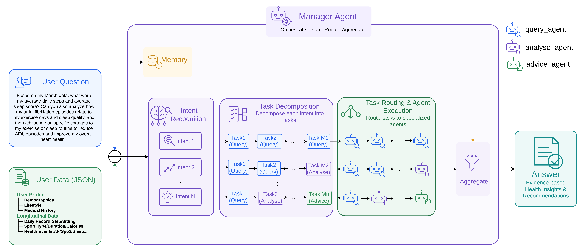
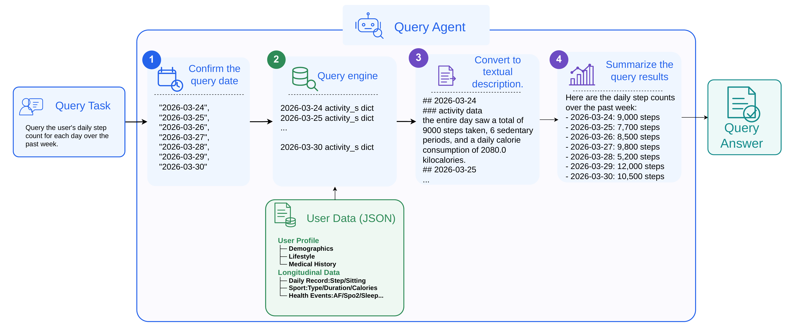

# WearableDeviceAgents

An LLM-powered, task-oriented multi-agent framework for complex wearable health analysis. It answers natural-language questions about structured wearable records through querying, analysis, and health-support advice.

## Framework

<p align="center">
  
</p>

## Query Agent

<p align="center">
  
</p>

## Installation

Use Python 3.12 (the repository specifies 3.12.13), preferably in a virtual environment.

```bash
git clone https://github.com/yangkunpeng-coder/WearableDeviceAgents.git
cd WearableDeviceAgents
python -m pip install -r requirements.txt
```

The dependency file uses the Tencent Cloud PyPI mirror and includes an unconditional `pywin32` dependency, which may prevent installation on non-Windows systems.

## Configuration

Set API keys in your process environment before starting Python:

| Environment variable | Used by |
| --- | --- |
| `DEEPSEEK_API_KEY` | Required for the examples below. `brain_s/deepseek_v4_pro.py` calls `deepseek-v4-pro` at `https://api.deepseek.com`. |
| `DASHSCOPE_API_KEY` | Optional; used when selecting `model_type='qwen'` through `agent_s/agent_config.py`. |

The AgentScope configuration in `agent_s/agent_config.py` uses `deepseek-chat` or `qwen3-max`; it is separate from the examples' DeepSeek brain. There is no `.env.example` or automatic `.env` loading in the application code.

## Dataset

The repository includes synthetic smartwatch user profiles and wearable records, with LLM-based generation code in [generate_role_agent.py](agent_s/generate_role_agent.py) and [generate_data_agent.py](agent_s/generate_data_agent.py).

- **10,000 profiles** in [role_list_en_10000.json](data/role_list_en_10000.json), covering demographics, lifestyle, and medical history.
- **1,000 role record files** in [roles_data_en_10000](data/roles_data_en_10000), containing 29,561 dated entries spanning March 1–31, 2026. Record counts vary by role; the directory name does not indicate the number of included files.
- Records include exercise, daily steps, calories, sedentary counts, sleep, blood oxygen, and event indicators for atrial fibrillation, premature heartbeats, and sleep apnea. See [an example record](data/roles_data_en_10000/role_data_1.json).

## Experiments & Results

The repository includes experiments for [structured queries](experiment/query_agent_evaluation), [multi-intent recognition](experiment/mult_intent_task_evaluation), and [multi-agent answers and multi-dimensional trend analysis](experiment/mult_agents_evaluation). The answer baseline prompts an LLM directly with the user's records. Current inference code uses `deepseek-v4-pro`; query judging uses the separate AgentScope configuration.

The following results are recomputed from the bundled JSON outputs, not a fresh experiment run. Saved outputs do not establish the exact model version used to produce them.

| Evaluation | Sample size | WearableDeviceAgents | Direct LLM baseline |
| --- | --- | --- | --- |
| Query accuracy (LLM-judged) | 1,500 questions / 300 roles | 98.33% | 97.87% |
| Mean tokens per query | Same 1,500 questions | 3,135.73 | 6,869.12 |
| Intent coverage | 180 questions / 30 roles | 100.00% | — |
| Intent multiset Jaccard | Same 180 questions | 94.37% | — |
| Multi-agent answer quality: trustworthiness / transparency / actionability | 180 questions / 30 roles | 3.77 / 3.94 / 3.00 | 3.45 / 3.06 / 3.17 |
| Multi-dimensional trend quality: same three dimensions | 100 questions / 10 roles | 4.50 / 4.14 / 1.65 | 4.33 / 3.92 / 1.62 |

Quality scores are LLM-assigned means on a 1–5 scale. The multi-agent scoring input includes extracted evidence and task traces alongside its answer. Intent coverage measures recovered reference intent types; multiset Jaccard also accounts for repeated types.

Sources: [query judgments](experiment/query_agent_evaluation/query_answer_judge.json), [intent predictions](experiment/mult_agents_evaluation/mult_agent_answer_s.json), [answer scores](experiment/mult_agents_evaluation/mult_agent_scores.json), and [trend scores](experiment/mult_agents_evaluation/mult_dim_trend_scores.json).

After installing dependencies, reproduce the saved-output statistics from the repository root without API calls:

```bash
python -c "import os, runpy, sys; sys.path.insert(0, os.getcwd()); os.chdir('experiment/query_agent_evaluation'); runpy.run_module('experiment.query_agent_evaluation.statistics_query_result', run_name='__main__')"
python -c "import os, runpy, sys; sys.path.insert(0, os.getcwd()); os.chdir('experiment/mult_intent_task_evaluation'); runpy.run_module('experiment.mult_intent_task_evaluation.statistics_intent_result', run_name='__main__')"
python -c "import os, runpy, sys; sys.path.insert(0, os.getcwd()); os.chdir('experiment/mult_agents_evaluation'); runpy.run_module('experiment.mult_agents_evaluation.statistics_score', run_name='__main__')"
```

These print query accuracy and token means, intent metrics, and trend quality scores, respectively. `statistics_score.py` currently reads only `mult_dim_trend_scores.json`. Inference scripts use API keys and resume from existing result files; inspect their paths and resume logic before rerunning experiments.

## Paper

**A Task-Oriented Multi-Agent Framework for Complex Wearable Health Analysis**

Author: Kunpeng Yang

arXiv: [https://arxiv.org/abs/2609.24107](https://arxiv.org/abs/2609.24107)

DOI: [https://doi.org/10.48550/arXiv.2609.24107](https://doi.org/10.48550/arXiv.2609.24107)

Category: Multiagent Systems (cs.MA)

## Citation

```bibtex
@article{yang2026taskoriented,
  title={A Task-Oriented Multi-Agent Framework for Complex Wearable Health Analysis},
  author={Yang, Kunpeng},
  journal={arXiv preprint arXiv:2609.24107},
  year={2026},
  doi={10.48550/arXiv.2609.24107}
}
```

## Disclaimer

This repository is a research prototype.

It is not a medical device and should not be used for diagnosis, treatment, or professional medical decision-making.
